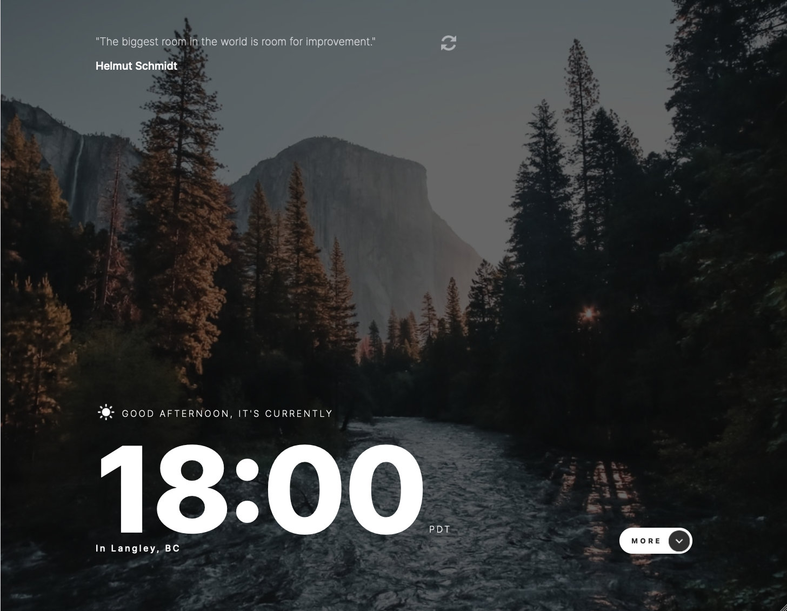
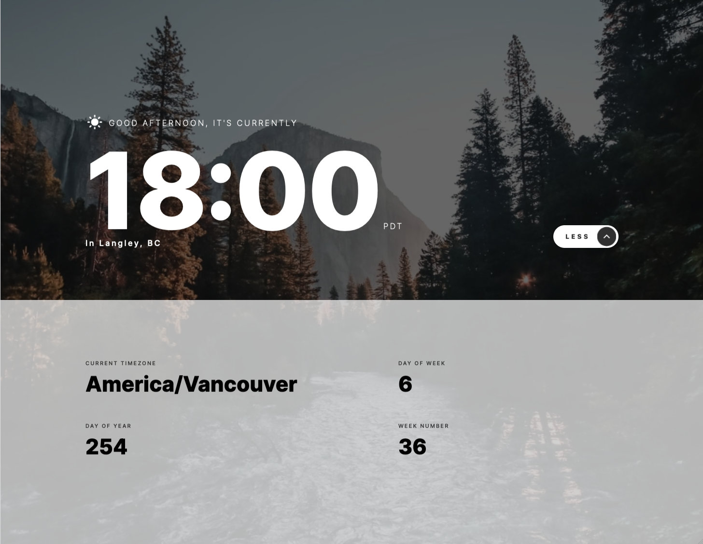
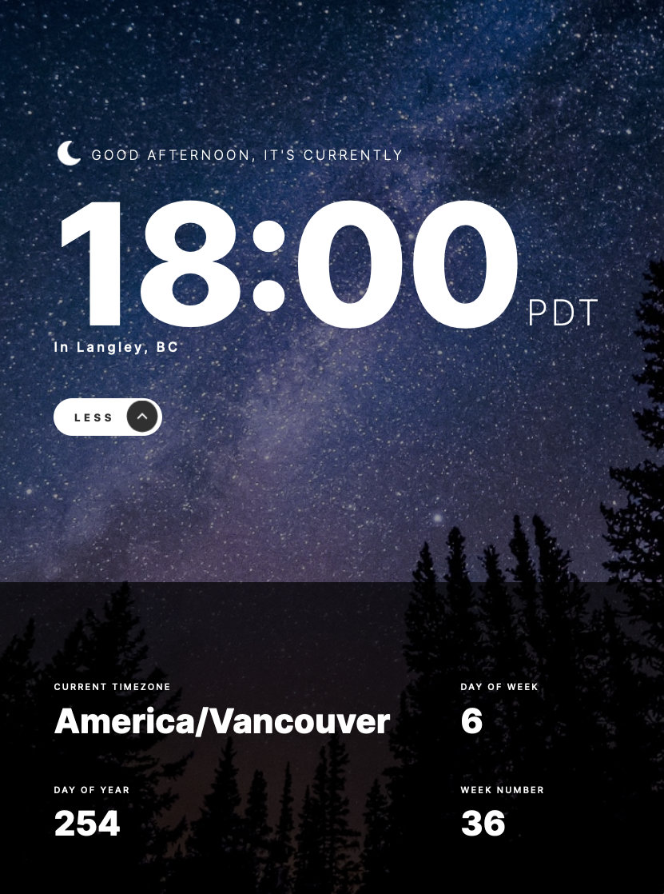
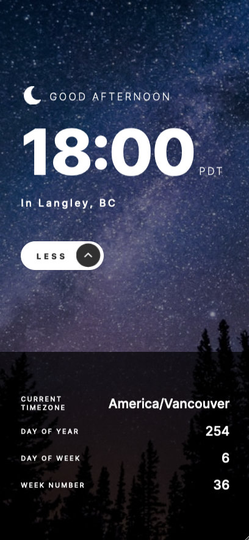
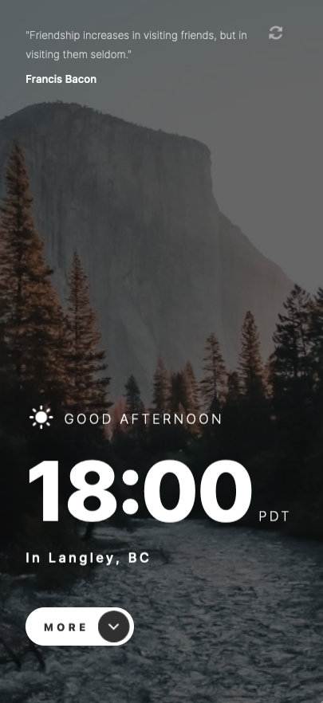
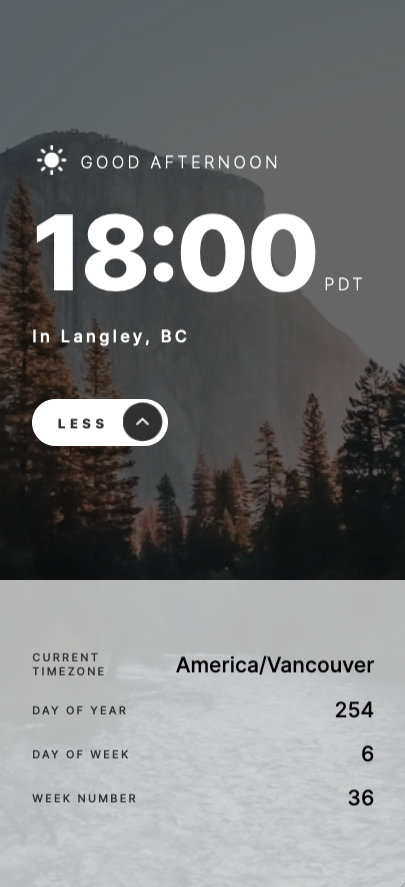

# Frontend Mentor - Clock app solution

This is a solution to the [Clock app challenge on Frontend Mentor](https://www.frontendmentor.io/challenges/clock-app-LMFaxFwrM). Frontend Mentor challenges help you improve your coding skills by building realistic projects. 

## Table of contents

- [Overview](#overview)
  - [The challenge](#the-challenge)
  - [Screenshot](#screenshot)
  - [Links](#links)
- [My process](#my-process)
  - [Built with](#built-with)
  - [What I learned](#what-i-learned)
  - [Continued development](#continued-development)
  - [Useful resources](#useful-resources)
- [Author](#author)
- [Acknowledgments](#acknowledgments)

**Note: Delete this note and update the table of contents based on what sections you keep.**

## Overview

### The challenge

Users should be able to:

- View the optimal layout for the site depending on their device's screen size
- See hover states for all interactive elements on the page
- View the current time and location information based on their IP address
- View additional information about the date and time in the expanded state
- Be shown the correct greeting and background image based on the time of day they're visiting the site
- Generate random programming quotes by clicking the refresh icon near the quote

### Screenshot








### Links

- Solution URL: [Front End Mentors](https://your-solution-url.com)
- Live Site URL: [Vercel](https://fem-clock-app.vercel.app)

## My process

### Built with

- Semantic HTML5 markup
- CSS custom properties
- CSS modules
- Flexbox
- CSS Grid
- Mobile-first workflow
- [React](https://reactjs.org/) - JS library
- [Next.js](https://nextjs.org/) - React framework

### What I learned

#### Managing application/page state

In evaluating the requirements of this project, I recognized that there were several aspects that would most obviously constitute a sort of `application state`. These included: 
- current quote (external data)
- world-time data (external data)
- location data (external data)
- current time-of-day "categorization" (morning, afternoon, evening) 
- the toggling of the (using the language of the design file) "active"/"inactive" panel which is to slide up from the bottom of the screen

This data both changes over time and needs to be shared/consumed in various locations throughout the application. For example, the time-of-day categorization impacts the theme in several different places (background image, color scheme of the "active" panel, icon and text used for the greeting). As such, I researched several approaches to state management in `React`.  

> I appreciate that many React projects use `Redux` for state management and that it would be a valuable skill to learn for working on existing projects. As a counterpoint, the `React` community appears to be challenging the appropriateness of adopting `Redux` patterns for new projects in light of several developments. 
>
> Firstly, `React` now offers the more robust `context` API natively. This is a very polished and well tested strategy for supplying data to deeply nested components. Secondly, `React` now offers the `useReducer` hook, which encourages a very similar strategy to the `Redux` pattern but witha a more integrated design philosophy.
> 
> It should be noted that the created of `Redux`, Dan Abramov, has said that people should not jump to including `Redux` in their projects ([You Might Not Need Redux](https://medium.com/@dan_abramov/you-might-not-need-redux-be46360cf367)) and has gone so far as to say that he ["doesn't like Redux"](https://twitter.com/dan_abramov/status/1241756566048694272?lang=en). Several other prominent "thought-leaders" in the React community have voiced their problems with `Redux`, namely it's convolutedness and encouragement of making all or most state global.

Given that the model of the application-state is quite simple, I elected to go with the native `useState` hook paired with a pattern of "orchestrating" components rather than deeply nesting the component tree. This approach suggests that components should focus on their sole responsibility and merely render children components. Then, at a much higher level up the component tree, the components should be defined explicitly in the orchestrating component. 

```js
// Deeply Nested example 

function PageComponent(props) {
  return (
    <ParentComponent {...props} />
  )
}
function ParentComponent(props) {
  return (
    <div>
      <FirstLevelChildComponent {...props} />
    </div>
  )
}

function FirstLevelChildComponent(props) {
  return (
    <div>
      <SecondLevelChildComponent {...props} />
    </div>
  )
}

// etc

// "Orchestrating Component"

function OrchestratingComponent(props) {
  const [parentProps, setParentProps] = useState()
  const [firstLevelChildProps, setFirstLevelChildProps] = useState()
  const [secondLevelChildProps, setSecondLevelChildProps] = useState()
  const [differentFirstLevelChildProps, setDifferentFirstLevelChildProps] = useState()
  const [differentSecondLevelChildProps, setDifferentSecondLevelChildProps] = useState()

  <>
    <ParentComponent 
      parentProps={parentProps} 
      setParentProps={setparentProps}
    >
     <FirstLevelChild 
      firstLevelChildProps={firstLevelChildProps} 
      setFirstLevelChildProps={setFirstLevelChildProps}
    >
      <SecondLevelChild 
        secondLevelChildProps={secondLevelChildProps} 
        setSecondLevelChildProps={setSecondLevelChildProps} 
      />
    </FirstLevelChild>
    <DifferentFirstLevelChild 
      differentFirstLevelChildProps={differentFirstLevelChildProps} 
      setDifferentFirstLevelChildProps={setDifferentFirstLevelChildProps}
    >
      <DifferentSecondLevelChild 
        differentSecondLevelChildProps={differentSecondLevelChildProps} 
        setDifferentSecondLevelChildProps={setDifferentSecondLevelChildProps} 
      />
     </DifferentFirstLevelChild>
    </ParentComponent>
  </>
}

```

By architecting the component tree in this way, we gain a few advantages:  
  - avoid unneccessary re-renders of parallel branches of the component tree if the grouped props (being passed down each layer to all the children components)
  - make component dependencies explicit at each stage rather than grouping them together and (maybe) splitting them as you dive down the component tree 
  - isolate the concerns of each component rather than also doubling as a data provider to its child components
  - allow for simple extraction of locally managed state to an orchestrating component higher on the component tree (and provision of that state as a prop to the relavent children)

This architecture does not need to be taken to its extreme. Certain components make sense to act as an API barrier. But these decisions become intentional rather than habit. Similarly, the strategy can be employed recursively. When it is decided that a certain level of a component heirarchy will become an orchestrator for its children, it will receive the subset of data that its tree requires, potentially skipping several layers of nesting, and will then be a point of focus for concerns regarding the data provided to its sub-tree of components. 

#### Managing external data with react-query

One of the requirements of this project was fetching data from three third-party APIs. In tackling this challenge, I researched various strategies for data-fetching in React. The simplistic strategy is to fetch on component mount by making use of the `useEffect` hook and providing an empty array as the second argument (the dependency list). This pattern results in the data being fetched once and the effect not running unless the component is unmounted and remounted. 

As an initial proof-of-concept, I did employ this simplistic strategy. I decided that by fetching the data at the page-component level, this would reduce the number of network requests regardless of the activity of the component tree. But as I progressed through developing this feature, I realized that I needed several not so simple features (such as refetching). At this point, I considered whether the `React` community had coalesced around a solution and discovered that the leading library was one called `react-query`. This library offered many niceties that I haden't yet contemplated in the scope of this project and it offered a hooks-based API.

One of the above named "niceties" was the request-state flags (in progress, resolved, errored, etc) and helper functions to deal with these states (such as configurations for retry behaviours). 

This library was very effective at managing the network activity of this project.

#### Strategy for Project-wide css architecture

After my first "hacky" attempt at layout out the design, I realized that I had overcomplicated my layout. I printed out the various frames of the design file and spent an evening with a pencil marking up these designs, and eventually observed the implicit patterns of the design.

Firstly, I observed that the overall design consisted of a full width background with a nested "maximum width" container. In the application state where the "active" panel appears, it is overlayed on the background image and its content conforms to this maximum width constraint. Therefore, the notion of "maximum width" needed to be portable: it needed to be relative to the device width when nested in an arbitrary number of parent components.

Next, I noticed that the application roughly consisted of three "units": the quotes, the current time, and the additional info panel. From marking up the design sheets, I observed that the design called for the quotes and additional info panel to take up roughly 1/3 of the vertical height of the viewport, while the current time section consumed 2/3 of the vertical height. The quotes and additional info sections alternated being visible, and therefore it could be thought of as a fixed height container, with either the quote or more info panel taking up 1/3 and the current time taking up the remaining 2/3. This ratio is modified to 1/2 and 1/2 when in desktop widths.

Considering these proportions, I created a container of 100vh (with overflow hidden) to simulate a full-screen app. The three sections mentioned above are stacked vertically with their heights set as the respective proportions (in vh). This results in the bottom panel being hidden and the window not scrollable. The transition then simply translates the bottom two sections up by this same 34vh (or 50vh on desktop). Overall, this creates a simple and predictable css architecture. 
#### Theming with CSS custom properties

In using plain CSS modules, a "theming" architecture must be created from scratch. I followed the advice outlined in the blog post on [LogRocket](https://blog.logrocket.com/a-guide-to-theming-in-css/). In the LogRocket post, the author provided the tip of using `CSS custom properties` and switching the theme on a `data` attribute in the markup. This allows for components to simply define properties in terms of namespaced `CSS custom properties` (here using the namespace `--theme-`): 


```css
[data-theme="light"] {
  --theme-var-1: #ABCDEF;
}
[data-theme="dark"] {
  --theme-var-1: #012345;
}
```

I then used a simple state flag to set the theme on the parent component. This allows for the theme to be encapsuated in a global css file rather than scattered throughout relavent components. And by swapping the data attribute using a managed state within the parent component, these changes cascade to all consuming components.

In developing this approach, I discovered a pattern of storing incomplete/invalid CSS color values in `custom properties` to allow for variants. This is a fragile approach as it results in bare numerical values being stored and then (hopefully) consumed using the correct colour function (but it does work well if the context is obvious). By not settling the value into a specific function, it is possible to set the opacity at the point of consuming the value. 

```css 
[data-theme="light"] {
  --theme__color-primary: 200, 200, 200
  --theme__color-primary--contrast: 200, 200, 200
}
[data-theme="light"] {
  --theme__color-primary: 40, 40, 40
  --theme__color-primary--contrast: 200, 200, 200
}

.consuming_component_class {
  background-color: rgba(var(--theme__color-primary, 0.4))
  color: rgb(var(--theme__color-primary--contrast)
}
```

This fragility could be overcome by establishing a team convention, such as including the color format in the property name. For example, I can imagine that re-using an HSL value without settling its L value would be a practical way of creating different shades of the design colors.

```css
:root {
  --colorHS__primary: 20, 20
  --colorHSL__primary--100: var(--colorHS__primary), 10%
  --colorHSL__primary--200: var(--colorHS__primary), 20%
  --colorHSL__primary--300: var(--colorHS__primary), 30%
  --colorHSL__primary--400: var(--colorHS__primary), 40%
  --colorHSL__primary--500: var(--colorHS__primary), 50%
  --colorHSL__primary--600: var(--colorHS__primary), 60%
  --colorHSL__primary--700: var(--colorHS__primary), 70%
  --colorHSL__primary--800: var(--colorHS__primary), 80%
  --colorHSL__primary--900: var(--colorHS__primary), 90%
}

.someClass {
  color: hsl(var(--colorHSL__primary--800));
  background-color: hsla(var(--colorHSL__primary-300), 0.7)
}

```

#### Continued development

For future projects, I want to challenge myself to implement a more complicated application state. This project had very trivial state and allowed me to gain confidence in architecting state, but realistically I need to be able to tackle larger problems.

Additionally, I want to improve my network error handling. With these APIs, I essentially "set it and forget it", relying on the react-query retry functionality to overcome any network issues. Given that the user is only passively engaged with the data, this is probably tolerable in this context. In most contexts, I would need to be able to recover or engage with the user in case of errors.

## Author

- Frontend Mentor - [@justin-m-morgan](https://www.frontendmentor.io/profile/justin-m-morgan)
- Twitter - [@_catsonfilm](https://www.twitter.com/_catsonfilm)

